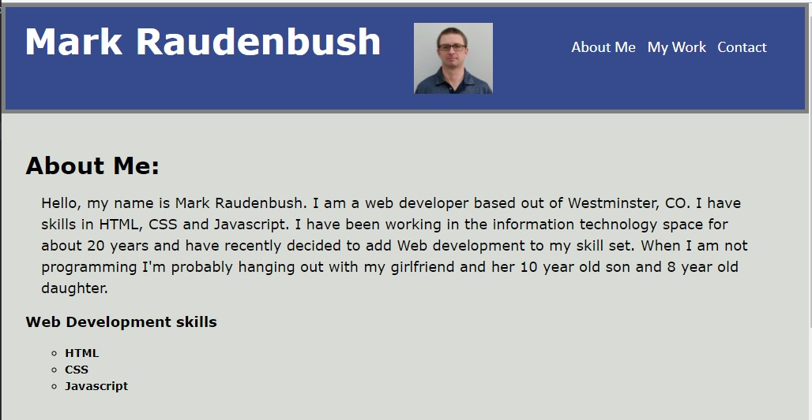
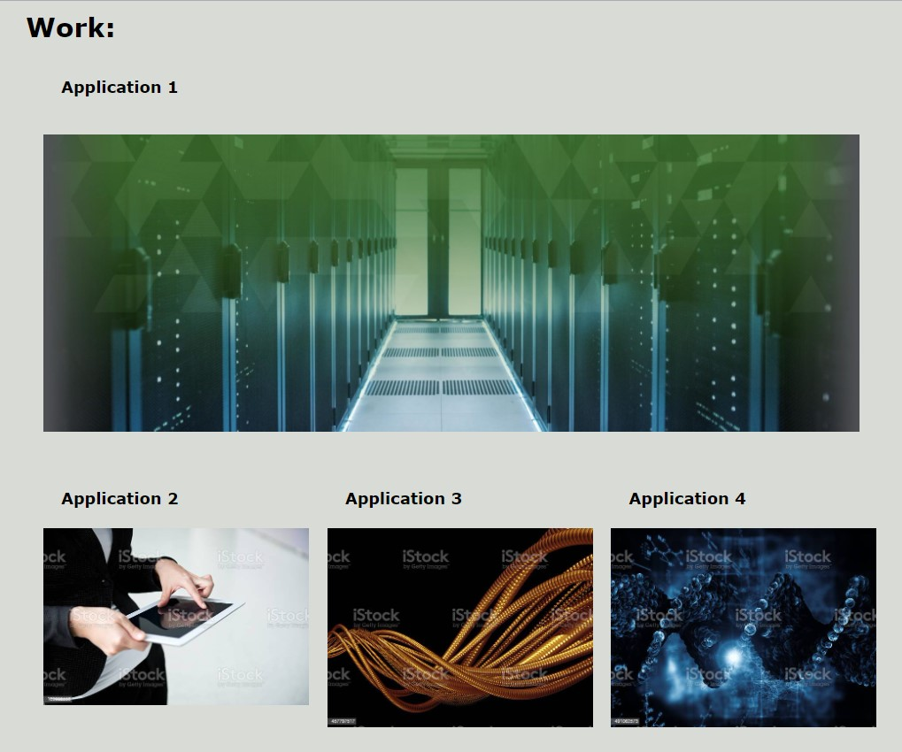
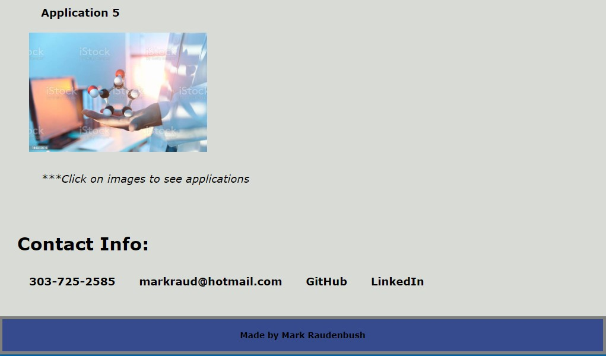

# Homework - 02 Advanced CSS: Portfolio
### Overview:
This is the second homework that is required for the University of Denver Coding Boot Camp.  The assignment was to create a developer portfolio of work samples to be made available for review by potential employers. 

#### Code: 
The website is built with HTML and CSS(including flexbox). 
1. Header including name, image and navigation links.
2. About me section with information about myself.
3. Work section with images linking to applications(these are just place holders for now).
4. Contact section with phone, email and links to GitHub and LinkedIn.
5. Footer

#### Links:

- [Link to the developer portfolio](https://markraud.github.io/hw-02-advanced-css-portfolio).

- [Link to GitHub Repository](https://github.com/markraud/hw-02-advanced-css-portfolio).

#### Screenshots of the site:

#### Summary:

This project taught me about using HTML and CSS.  Making the site responsive was particularly tough.
Further work will need to be done to improve my skills with CSS(including Flexbox). 
